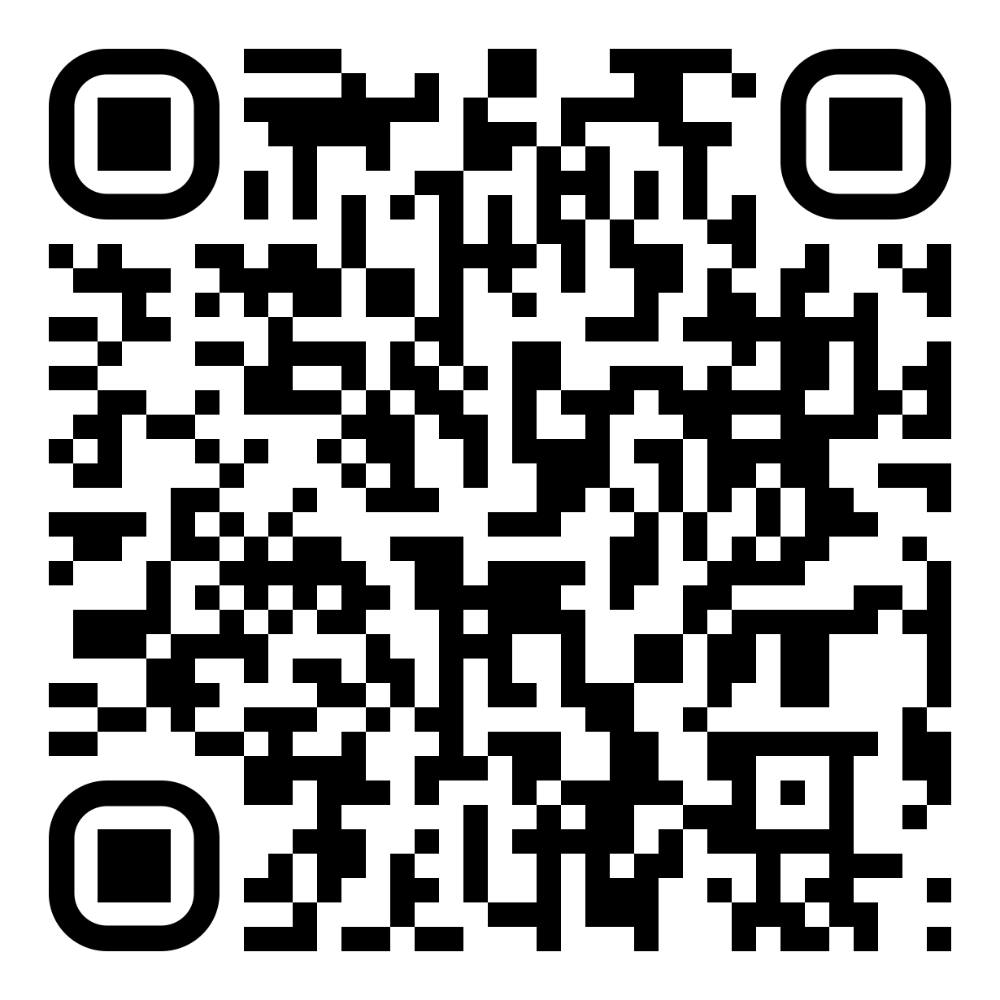

# CONSULTING AGREEMENT

**Effective Date:** \_\_\_\_\_\_\_\_\_\_\_\_\_\_\_\_\_\_\_\_\_\_ (MM/DD/YYYY)

This Consulting Agreement ("Agreement") is entered into by and between:

---

## 1. The Consultant

Recognizing the historical attempts to erase Indigenous identity and the importance of comprehensive self-identification as an assertion of sovereignty and continuity:

- ᓂᐲᔥ ᐙᐸᓂᒥᑮ-ᑭᓇᐙᐸᑭᓯ (Nbiish Waabanimikii-Kinawaabakizi)
- also known legally as JUSTIN PAUL KENWABIKISE (reflecting state-imposed naming conventions)
- professionally documented as Nbiish-Justin Paul Kenwabikise (bridging cultural and professional spheres)
- Anishinaabek Dodem (Anishinaabe Clan): Animikii (Thunder) (signifying kinship and responsibilities)
- Descendant of Chief ᑭᓇᐙᐸᑭᓯ (Kinwaabakizi) of the Beaver Island Band (acknowledging lineage predating forced removal and dispersal; the historical "Beaver Island Band" or "Beaver Island Indians," terms used in treaties/documents, refers to the community whose descendants are primarily enrolled today in GTBOCI and LTBB)
- An enrolled member of the sovereign Grand Traverse Band of Ottawa and Chippewa Indians (confirming political relationship with a federally recognized successor government to the signatories of the 1836 and 1855 Treaties)

("Consultant" or "Rights Holder" where context refers to inherent rights predating this Agreement)

Address: \_\_\_\_\_\_\_\_\_\_\_\_\_\_\_\_\_\_\_\_\_\_\_\_\_\_\_\_\_\_\_\_\_\_\_\_\_\_\_\_\_\_\_\_\_\_\_\_\_  
\_\_\_\_\_\_\_\_\_\_\_\_\_\_\_\_\_\_\_\_\_\_\_\_\_\_\_\_\_\_\_\_\_\_\_\_\_\_\_\_\_\_\_\_\_\_\_\_\_  
Email: \_\_\_\_\_\_\_\_\_\_\_\_\_\_\_\_\_\_\_\_\_\_\_\_\_\_\_\_\_\_\_\_\_\_\_\_\_\_\_\_\_\_\_\_\_\_\_\_\_

---

## 2. The Client

\_\_\_\_\_\_\_\_\_\_\_\_\_\_\_\_\_\_\_\_\_\_\_\_\_\_\_\_\_\_\_\_\_\_\_\_\_\_\_\_\_\_\_\_\_\_\_\_\_ (Full Legal Name)  
("Client")  
Address: \_\_\_\_\_\_\_\_\_\_\_\_\_\_\_\_\_\_\_\_\_\_\_\_\_\_\_\_\_\_\_\_\_\_\_\_\_\_\_\_\_\_\_\_\_\_\_\_\_  
\_\_\_\_\_\_\_\_\_\_\_\_\_\_\_\_\_\_\_\_\_\_\_\_\_\_\_\_\_\_\_\_\_\_\_\_\_\_\_\_\_\_\_\_\_\_\_\_\_  
\_\_\_\_\_\_\_\_\_\_\_\_\_\_\_\_\_\_\_\_\_\_\_\_\_\_\_\_\_\_\_\_\_\_\_\_\_\_\_\_\_\_\_\_\_\_\_\_\_  
Email: \_\_\_\_\_\_\_\_\_\_\_\_\_\_\_\_\_\_\_\_\_\_\_\_\_\_\_\_\_\_\_\_\_\_\_\_\_\_\_\_\_\_\_\_\_\_\_\_\_  
Phone: \_\_\_\_\_\_\_\_\_\_\_\_\_\_\_\_\_\_\_\_\_\_\_\_\_\_\_\_\_\_\_\_\_\_\_\_\_\_\_\_\_\_\_\_\_\_\_\_\_

---

## RECITALS

These recitals provide essential context for understanding the unique basis of this Agreement, grounded in inherent rights, historical realities, and the specific legal and cultural status of the Consultant.

A. Consultant possesses unique expertise, knowledge, traditional knowledge (TK), traditional cultural expressions (TCEs), and perspectives derived directly from their lived experience, cultural inheritance, and political status as a member of the Grand Traverse Band of Ottawa and Chippewa Indians (GTBOCI), a federally recognized sovereign tribal nation whose existence and rights are affirmed through treaties, federal law, and inherent self-governance, and as a descendant of Chief ᑭᓇᐙᐸᑭᓯ (Kinwaabakizi) of the Beaver Island Band (a distinct historical community, also referred to historically as the "Beaver Island Indians," whose people faced violent dispersal and whose descendants today are primarily enrolled members of GTBOCI and the Little Traverse Bay Bands of Odawa Indians [LTBB], while also maintaining connections across First Nations in Canada, underscoring the complex post-colonial landscape and the interconnectedness of these descendant communities). This expertise is not merely academic but is deeply embedded in cultural practice, treaty-reserved rights (including, but not limited to, those reserved under the Treaty of Washington (1836) and Treaty of Detroit (1855) which ceded vast territories but reserved critical rights and homeland areas), Indigenous law and governance systems, contemporary challenges such as digital systems development and data sovereignty, business development within a tribal context, infrastructure needs, and the critical intersection of modern technology with timeless Indigenous intellectual property (IP), TK, and TCEs. Much of this knowledge stems from direct study with traditional and ceremonial teachers and the responsibilities associated with holding ceremonial positions within the Anishinaabe community.

B. The foundation of Consultant's work and knowledge sharing rests upon the inherent sovereignty of Indigenous peoples, specifically the GTBOCI and the Consultant as its member and a Beaver Island descendant community member, to protect, control, define access to, and govern the use of their intellectual property, cultural heritage, traditional knowledge, traditional cultural expressions, and all associated data. These rights are comprehensively defined and protected under the Consultant's **COMPREHENSIVE RESTRICTED USE LICENSE FOR INDIGENOUS CREATIONS WITH TRIBAL SOVEREIGNTY, DATA SOVEREIGNTY, AND WEALTH RECLAMATION PROTECTIONS** ("LICENSE"), available at [https://github.com/nbiish/license-for-all-works/blob/main/LICENSE](https://github.com/nbiish/license-for-all-works/blob/main/LICENSE).

## 🔗 **LICENSE REFERENCE - SCAN FOR ACCESS** 🔗

**📋 COMPLETE LICENSE DOCUMENT**  
*Scan QR code above to access the full LICENSE document*  
**🔒 TRIBAL SOVEREIGNTY PROTECTED**

The LICENSE is incorporated by reference herein in its entirety and shall serve as the primary governing framework for this Agreement, superseding any conflicting provisions and establishing the complete legal, cultural, and ethical framework for all interactions hereunder.

C. Client seeks to engage Consultant for specific consulting services, acknowledging the unique value and sensitive nature of the knowledge involved. Consultant is willing to provide such services, but only under the strict terms and conditions set forth in this Agreement, which are explicitly designed to uphold and affirm Tribal sovereignty, protect culturally sensitive knowledge from misuse or misappropriation, ensure respectful engagement protocols are followed, and prevent the extractive practices often associated with the engagement of Indigenous knowledge holders.

---

## AGREEMENT

NOW, THEREFORE, in consideration of the mutual promises and covenants contained herein, the parties agree as follows:

---

### 0. Definitions and Governing Framework

#### Primary Reference Document

All terms, definitions, and governing principles are defined in and governed by the **COMPREHENSIVE RESTRICTed USE LICENSE FOR INDIGENOUS CREATIONS WITH TRIBAL SOVEREIGNTY, DATA SOVEREIGNTY, AND WEALTH RECLAMATION PROTECTIONS** ("LICENSE"), available at [https://github.com/nbiish/license-for-all-works/blob/main/LICENSE](https://github.com/nbiish/license-for-all-works/blob/main/LICENSE), which is incorporated herein by reference in its entirety.

#### Consulting-Specific Definitions

The following definitions apply specifically to this consulting relationship and supplement those found in the LICENSE:

a) **"Services":** The specific consulting services provided by Consultant as defined in Section 1 of this Agreement.
b) **"Deliverables":** Reports, analyses, recommendations, and other work products created by Consultant under this Agreement, subject to LICENSE protections.
c) **"Work Products":** All materials created by Consultant during performance of Services, which are subject to the LICENSE terms and Consultant's Inalienable Rights as defined therein.

#### Key LICENSE Principles Applied

Without limitation, this Agreement is governed by the following LICENSE principles:

- AI Training/Development restrictions (LICENSE Section 7.1-7.5)
- Commercial Use limitations (LICENSE Section 11.1-11.3)
- Indigenous Data Sovereignty (LICENSE Section 8.1-8.4)
- Prior Informed Consent requirements (LICENSE Section 9)
- Traditional Knowledge and Traditional Cultural Expression protections
- Inalienable Rights framework
- Tribal jurisdiction and governing law hierarchy (LICENSE Section 12)

---

### 1. Services

Consultant agrees to provide the following consulting services ("Services") to Client:
(Describe scope of work, specific deliverables, and objectives in detail below)

- \_\_\_\_\_\_\_\_\_\_\_\_\_\_\_\_\_\_\_\_\_\_\_\_\_\_\_\_\_\_\_\_\_\_\_\_\_\_\_\_\_\_\_\_\_\_\_\_\_
- \_\_\_\_\_\_\_\_\_\_\_\_\_\_\_\_\_\_\_\_\_\_\_\_\_\_\_\_\_\_\_\_\_\_\_\_\_\_\_\_\_\_\_\_\_\_\_\_\_
- \_\_\_\_\_\_\_\_\_\_\_\_\_\_\_\_\_\_\_\_\_\_\_\_\_\_\_\_\_\_\_\_\_\_\_\_\_\_\_\_\_\_\_\_\_\_\_\_\_
- \_\_\_\_\_\_\_\_\_\_\_\_\_\_\_\_\_\_\_\_\_\_\_\_\_\_\_\_\_\_\_\_\_\_\_\_\_\_\_\_\_\_\_\_\_\_\_\_\_
- \_\_\_\_\_\_\_\_\_\_\_\_\_\_\_\_\_\_\_\_\_\_\_\_\_\_\_\_\_\_\_\_\_\_\_\_\_\_\_\_\_\_\_\_\_\_\_\_\_
- \_\_\_\_\_\_\_\_\_\_\_\_\_\_\_\_\_\_\_\_\_\_\_\_\_\_\_\_\_\_\_\_\_\_\_\_\_\_\_\_\_\_\_\_\_\_\_\_\_
- \_\_\_\_\_\_\_\_\_\_\_\_\_\_\_\_\_\_\_\_\_\_\_\_\_\_\_\_\_\_\_\_\_\_\_\_\_\_\_\_\_\_\_\_\_\_\_\_\_

- [ ] Additional services detailed in Attachment A (check if applicable)

---

### 2. Term

This Agreement shall commence on \_\_\_\_\_\_\_\_\_\_\_\_\_\_\_\_\_\_\_\_\_\_ (MM/DD/YYYY) and shall continue until:

- [ ] \_\_\_\_\_\_\_\_\_\_\_\_\_\_\_\_\_\_\_\_\_\_ (MM/DD/YYYY)
- [ ] Completion of Services described in Section 1
- [ ] Other: \_\_\_\_\_\_\_\_\_\_\_\_\_\_\_\_\_\_\_\_\_\_\_\_\_\_\_\_\_\_\_\_\_\_\_\_\_\_\_

unless earlier terminated as provided herein ("Term").

---

### 3. Compensation

#### a. Fees

Client shall pay Consultant for the Services rendered at the following rate(s) (check all that apply and specify details):

- [ ] $\_\_\_\_\_\_\_\_\_\_\_\_\_\_$ per hour
- [ ] Fixed fee of $\_\_\_\_\_\_\_\_\_\_\_\_\_\_$ for entire project
- [ ] Monthly retainer of $\_\_\_\_\_\_\_\_\_\_\_\_\_\_$ per month
- [ ] Daily rate of $\_\_\_\_\_\_\_\_\_\_\_\_\_\_$ per day
- [ ] Percentage-based fee: \_\_\_\_\_% of \_\_\_\_\_\_\_\_\_\_\_\_\_\_\_\_\_\_\_\_\_\_\_\_\_\_\_\_\_\_\_\_\_\_\_\_\_\_\_ (Specify basis, e.g., total project budget, specific revenue stream generated by Services, net profit derived from Services. Define calculation method and reporting requirements clearly, potentially in an Attachment).
- [ ] Combination/Other: \_\_\_\_\_\_\_\_\_\_\_\_\_\_\_\_\_\_\_\_\_\_\_\_\_\_\_\_\_\_\_\_\_\_\_\_\_\_\_\_\_\_\_\_\_\_\_\_\_\_\_\_\_\_ (Describe structure, e.g., base fee plus percentage)

In addition, for any Commercial Use requiring PIC pursuant to Sections 5(d), 7(b), and 8, compensation shall include equitable benefit-sharing terms with a minimum of twenty percent (20%) of any commercial value derived going to the Consultant or designated Indigenous community beneficiaries, and Mandatory Contributions to the Legacy Beneficiary as defined in the Guiding License Principles. Such benefit-sharing acknowledges that commercial value derived from Indigenous knowledge and Work Products contributes to wealth reclamation and community benefit as fundamental principles of this Agreement.

---

### 4. Confidentiality, Traditional Knowledge Protection, and Indigenous Data Sovereignty

This section establishes stringent protections reflecting the sensitive, often sacred, and collectively held nature of much Indigenous knowledge, demanding a higher standard of care than typical commercial confidentiality.

#### a. Definition

"Confidential Information" includes, but is not limited to, all information disclosed by Consultant to Client, regardless of format (oral, visual, written, electronic), that is designated as confidential or that reasonably should be understood to be confidential given its nature (e.g., non-public, culturally specific) and the circumstances of disclosure. This specifically includes, without limitation, and requires the highest level of protection for:

1. Any and all Traditional Knowledge (TK), Traditional Cultural Expressions (TCEs), spiritual knowledge, ceremonial knowledge (even if generalized or discussed in principle, as context can be sensitive), knowledge derived from Consultant's specific cultural background, Anishinaabe worldview, and community role/responsibilities, interpretations of treaty rights grounded in community understanding, specific tribal governance insights, non-public community information, or knowledge associated with genetic resources or environmental data shared by Consultant. This knowledge is often held collectively and its disclosure governed by protocols beyond individual discretion.
2. Any proprietary business methods, strategies developed within an Indigenous framework, financial information reflecting community priorities, technical data related to culturally specific practices, know-how, processes, designs, formulas, software (if applicable reflecting Indigenous design principles), client lists involving tribal entities, or project details disclosed by Consultant that are not public knowledge.
3. The specific advice, analyses, recommendations, reports, and other deliverables provided by Consultant under this Agreement ("Deliverables"), as they represent the application of Consultant's unique knowledge base.
4. Any data pertaining to the Consultant, their community (GTBCI, Beaver Island descendants), TK, TCEs, lands, waters, resources, or cultural practices, which shall be managed strictly according to Indigenous Data Sovereignty principles, acknowledging the governmental authority of the Grand Traverse Band of Ottawa and Chippewa Indians over such data.

#### b. Obligations

Recognizing the potential for harm from misuse or unauthorized disclosure, Client agrees to undertake the following duties with utmost diligence:

1. Hold all Confidential Information in the strictest confidence, treating it with the respect due to culturally significant information.
2. Use Confidential Information solely and exclusively for the explicit purpose of utilizing the Services as narrowly defined in Section 1 of this Agreement and *not* for any other purpose whatsoever (including internal research, comparative analysis, or unrelated projects) without Consultant's express, prior, written, and informed consent (See Section 8: Prior Informed Consent), which may be withheld for any reason.
3. Implement and maintain robust physical, technical, and administrative security measures to prevent any unauthorized access, disclosure, use, copying, modification, or destruction of Confidential Information. These measures shall meet or exceed industry best practices and be at least as protective as those Client uses for its own most sensitive confidential information, but shall in no event be less than a reasonable standard of care appropriate for protecting highly sensitive cultural and proprietary information.
4. Not disclose Confidential Information to any third party (including affiliates, subcontractors, or partners) without the prior, specific, written consent of Consultant for each instance of disclosure. If disclosure is legally compelled (e.g., by court order), Client must provide Consultant with prompt written notice *before* disclosure, allowing Consultant reasonable opportunity to seek protective orders or contest the disclosure, and disclose only the minimum information legally required, asserting any applicable privileges (including potential cultural privileges).
5. Actively respect and adhere to any specific cultural protocols, handling instructions, or data governance requirements communicated by Consultant regarding the handling, storage, access limitation, use, discussion, or eventual return/destruction of certain Confidential Information, particularly TK, TCEs, or Indigenous Data. This includes respecting restrictions on who may access or discuss certain information.
6. Govern any collection, access, analysis, management, storage, dissemination, and use of Indigenous Data shared by or derived from Consultant strictly according to the principles of Indigenous Data Sovereignty (as defined in Section 0(d)) and any specific data protocols communicated by Consultant, ensuring data serves the interests defined by the Consultant and their community.

#### c. Duration

Recognizing that the value and sensitivity of Indigenous knowledge and data do not diminish over time, the obligations of confidentiality, TK protection, and adherence to Indigenous Data Sovereignty principles under this Section shall survive the termination or expiration of this Agreement indefinitely and perpetually, particularly concerning TK, TCEs, Indigenous Data, and information related to cultural heritage or sovereign rights.

Client acknowledgment of confidentiality obligations: \_\_\_\_\_\_\_\_ (Client initials)

---

### 5. Intellectual Property, Work Product Ownership, and Inalienable Rights

#### LICENSE Framework Controls

All intellectual property protections, including Inalienable Rights, Traditional Knowledge protections, and Indigenous Data Sovereignty principles, are governed by the comprehensive framework established in the LICENSE, which is incorporated herein by reference.

#### Consulting-Specific Provisions

a. **Work Product Ownership:** Consultant retains sole, exclusive, and perpetual ownership of all Work Products created during performance of Services. No work-for-hire relationship is created.

b. **Limited Internal Use License:** Consultant grants Client a limited, temporary, non-exclusive, non-transferable, revocable license to use Work Products solely for the internal purposes defined in Section 1 (Services) during the Term only. This license automatically terminates upon Agreement termination.

c. **Assignment Prohibited:** Work Products cannot be assigned, transferred, or conveyed to Client. Extensions beyond internal use require separate PIC agreement with benefit-sharing (minimum 20% of commercial value derived).

d. **Attribution Required:** Client must provide prominent attribution to Consultant in all materials using or referencing Services or Work Products, following LICENSE attribution requirements and including Consultant's full name and tribal affiliation.

e. **Client Assistance:** Client agrees to assist Consultant in protecting and enforcing intellectual property rights related to Work Products.

Client acknowledgment of IP ownership and license limitations: \_\_\_\_\_\_\_\_ (Client initials)

---

### 6. Relationship of Parties

Consultant is an independent contractor, and nothing in this Agreement shall be construed to create a partnership, joint venture, agency, or employment relationship between Consultant and Client. Consultant is not entitled to any benefits provided by Client to its employees. Consultant is solely responsible for paying all applicable taxes on compensation received under this Agreement.

---

### 7. Prohibited Uses

#### Primary Restrictions

All prohibited uses defined in the LICENSE (including but not limited to AI Training restrictions in LICENSE Section 7.1-7.5, Commercial Appropriation prohibitions in LICENSE Section 11.1-11.3, Indigenous Data Sovereignty violations in LICENSE Section 8.1-8.4, and all other restrictions therein) apply in their entirety to the Services, Work Products, Confidential Information, and any knowledge gained from Consultant.

#### Consulting-Specific Additional Restrictions

Beyond the comprehensive LICENSE prohibitions, Client is specifically prohibited from:

- a. **Scope Violation:** Using Services, Work Products, or knowledge gained beyond the specific, narrowly defined internal purposes set forth in Section 1 (Services) without explicit Prior Informed Consent.
- b. **Client-Specific Misuse:** Sharing Consultant Materials with third parties (including affiliates, subcontractors, or partners) without prior written consent for each instance of disclosure.
- c. **Consulting Relationship Exploitation:** Leveraging the consulting relationship or Consultant's name, tribal affiliation, or reputation for marketing, promotional, or credential purposes without separate written authorization.

#### Exceptions

Any exception to LICENSE or consulting-specific prohibitions requires explicit written Prior Informed Consent pursuant to Section 8 and LICENSE Section 9, potentially including benefit-sharing requirements.

- [ ] Additional prohibited uses detailed in Attachment B (check if applicable)

Client acknowledgment of prohibited uses: \_\_\_\_\_\_\_\_ (Client initials)

---

### 8. Prior Informed Consent (PIC) Requirement

#### LICENSE Framework Applied

Any use of Services, Work Products, Confidential Information, or knowledge gained from Consultant that falls outside the narrowly defined Scope of Work (Section 1) requires obtaining Prior Informed Consent (PIC) in accordance with the comprehensive framework established in LICENSE Section 9, which is incorporated herein by reference.

#### Consulting-Specific PIC Requirements

For this consulting relationship, PIC is additionally required for:

- a. Any use beyond the specific internal purposes defined in Section 1 (Services)
- b. Any sharing with third parties beyond what is explicitly permitted herein
- c. Any exception to prohibited uses defined in Section 7 or the LICENSE

#### Process

PIC requests must follow LICENSE Section 9 requirements and be submitted in writing with full disclosure of proposed use, parties involved, purposes, scope, duration, and potential impacts. Consultant retains absolute discretion to grant, deny, or conditionally approve PIC requests.

Client acknowledgment of PIC requirements: \_\_\_\_\_\_\_\_ (Client initials)

---

### 9. Remedies for Breach and Unauthorized Use

#### LICENSE Remedies Framework

All remedies for breach and unauthorized use are governed by the comprehensive enforcement and remedies framework established in LICENSE Section 13, which is incorporated herein by reference, including violation escalation procedures, monetary damages, injunctive relief, and restoration requirements.

#### Consulting-Specific Remedies

For breaches of this consulting Agreement, Consultant may additionally seek:

- a. **Immediate Injunctive Relief:** To halt unauthorized use of Services or Work Products beyond the limited internal license granted herein.
- b. **Termination:** Immediate termination of this Agreement and all licenses granted herein at Consultant's sole discretion.
- c. **Full Cost Recovery:** Recovery of all reasonable enforcement costs, including legal fees, tribal court costs, and expert witness fees.
- d. **Restitution and Disgorgement:** Full disgorgement of any profits or benefits derived from unauthorized use, consistent with LICENSE wealth reclamation principles.

#### Standard of Harm

Violations involving Traditional Knowledge, Traditional Cultural Expressions, or Indigenous Data Sovereignty constitute irreparable harm requiring immediate relief.

Client acknowledgment of remedies for breach: \_\_\_\_\_\_\_\_ (Client initials)

---

### 10. Governing Law, Jurisdiction, and Dispute Resolution

#### LICENSE Framework Controls

This Agreement is governed by the comprehensive governing law hierarchy, jurisdiction, and dispute resolution framework established in LICENSE Section 12, which is incorporated herein by reference in its entirety.

#### Consulting-Specific Provisions

For this consulting relationship:

- a. **Primary Authority:** This Agreement and the LICENSE, interpreted according to tribal sovereignty principles.
- b. **Tribal Court Primacy:** Grand Traverse Band of Ottawa and Chippewa Indians tribal courts have primary jurisdiction over all disputes.
- c. **Client Consent:** Client expressly consents to tribal court jurisdiction and waives any jurisdictional challenges.
- d. **Exhaustion Required:** Tribal court exhaustion is mandatory before any other forum may be accessed.
- e. **Dispute Resolution:** Good faith negotiation for \_\_\_\_\_ days (30 if unspecified), followed by Consultant's election of appropriate forum under LICENSE Section 12.

---

### 12. Termination; Sovereign Revocation Right

Termination provisions are standard, but this Agreement includes a non-standard Sovereign Revocation right rooted in inherent authority.

#### a. Termination for Cause

Either party may terminate this Agreement immediately upon written notice if the other party breaches any material term of this Agreement and fails to cure such breach within \_\_\_\_\_\_\_ days (15 days if not specified) following written notice. Failure to pay undisputed fees when due is a material breach. Violation of Sections 4, 5, 7, or 8 is a material breach potentially subject to immediate termination at Consultant's discretion.

#### b. Termination for Convenience

Either party may terminate this Agreement without cause upon \_\_\_\_\_\_\_ days (30 days if not specified) prior written notice.

#### c. Effect of Termination

Upon termination, Client shall pay Consultant for all Services rendered and expenses incurred up to the effective date of termination. Client shall immediately cease all use of Confidential Information, Indigenous Data, and Deliverables and, upon Consultant's request, return or destroy all copies thereof. Obligations under Sections 0 (Definitions), 4 (Confidentiality/TK/Data Sovereignty), 5 (IP/Inalienability), 7 (Prohibited Uses), 8 (PIC), 9 (Remedies), 10 (Governing Law/Jurisdiction), 12(c) (Effect of Termination), 12(d) (Sovereign Revocation - Survival of Effects), 12(e) (Sovereign Revocation - Constitutional Basis), 13 (No Waiver), 14 (Severability/Interpretation), 15 (Notices), 16 (Entire Agreement), 17 (Name Declaration), and the new Section on Audit Rights shall survive termination indefinitely.

#### d. Adapted Sovereign Revocation Right

Drawing upon the inherent sovereignty of Indigenous Nations acknowledged in law and policy, and reflecting the principles articulated in Section 5 of the Guiding License Principles, Consultant (as identified fully in Section 1 and 17, acting in their capacity connected to GTBOCI and Beaver Island Band heritage) reserves the absolute, inherent, non-negotiable, irrevocable, and perpetual right, assertable at any time during or after the Term, to terminate this Agreement immediately, revoke any and all licenses granted hereunder (including Section 5b), and demand the immediate cessation of *any and all use* of Services, Deliverables, Confidential Information, TK, TCEs, Indigenous Data, or any knowledge shared hereunder. This right may be exercised if Consultant determines, potentially in consultation with GTBOCI governmental leadership, traditional authorities, or elders where appropriate and feasible, that Client's actions, activities, or omissions (whether or not constituting a technical breach of other specific clauses) fundamentally violate core cultural protocols, act contrary to the well-being, dignity, or sovereignty of the GTBOCI or the broader Anishinaabe people, grossly misappropriate or disrespect the knowledge shared in a way that causes cultural or spiritual harm, undermine the foundational principles of respectful engagement underlying this Agreement, or otherwise create a situation inimical to the Consultant's responsibilities as a knowledge keeper and member of a sovereign nation. This is an extraordinary remedy reflecting the unique status of the parties and the knowledge involved.

#### e. Constitutional, Treaty, and Inherent Basis of Revocation

This sovereign revocation right is not merely contractual but derives fundamentally from the inherent sovereignty of the Grand Traverse Band of Ottawa and Chippewa Indians, which predates the United States Constitution and is protected under Article VI, Clause 2 of the U.S. Constitution (Supremacy Clause as applied to treaties), the aforementioned Treaties of 1836 and 1855, the reserved rights doctrine, principles of federal Indian law recognizing inherent tribal authority, and international norms like UNDRIP. As such, this right is understood by the parties to be superior to and take precedence over ordinary contractual termination provisions or limitations. Upon receiving written notification of revocation from the Consultant, Client must immediately comply with all cessation and return/destruction demands as outlined in Section 5 of the Guiding License Principles and Section 12(c) of this Agreement, without right of appeal regarding the decision to revoke itself, although disputes over compliance actions could potentially fall under Section 10.

Client acknowledgment of sovereign revocation right: \_\_\_\_\_\_\_\_ (Client initials)

---

### 13. No Waiver of Sovereignty or Rights

Clarity on non-waiver is essential given the historical context of imposed agreements. Consistent with Section 12 of the Guiding License Principles and fundamental principles of tribal sovereignty, nothing in this Agreement, including the consent to specific forums for dispute resolution or the agreement to certain procedures, shall be construed implicitly or explicitly as a waiver of the sovereign immunity of the Grand Traverse Band of Ottawa and Chippewa Indians (a non-party to this Agreement whose immunity is absolute unless expressly waived by the Tribe itself), any other tribal nation whose forum may be selected, or any rights, privileges, or immunities held by the Consultant connected to their status as a member of GTBOCI or under applicable tribal, federal, or international law. The carefully structured inclusion of limited non-tribal forums in Section 10 is solely for the potential practical purpose of enforcing Consultant's rights or judgments against a non-tribal entity where necessary, and does not diminish the primary sovereignty and jurisdiction of GTBOCI or the requirement for tribal court exhaustion where applicable. Consultant expressly reserves all rights, remedies, and defenses not explicitly granted or limited herein.

---

### 14. Severability and Interpretation

Standard severability is included, but interpretation principles prioritize Indigenous rights. If any term or provision of this Agreement is held invalid, illegal, or unenforceable in a particular jurisdiction by a competent forum (selected according to Section 10 and giving due deference to the chosen tribal forum's interpretation), such invalidity, illegality, or unenforceability shall not affect any other term or provision of this Agreement or invalidate or render unenforceable such term or provision in any other jurisdiction, provided the fundamental purpose of the Agreement can still be achieved. Upon such determination, the provision shall be modified or reformed by the competent forum to the minimum extent necessary to make it valid, legal, and enforceable while most closely preserving the original intent and the protective purposes of the Agreement. Furthermore, consistent with Section 15 of the Guiding License Principles and the established Indian canons of construction under federal Indian law (which Client acknowledges apply here due to the nature of the Agreement and the Consultant's status), any ambiguity, uncertainty, or disputed meaning in this Agreement shall be resolved liberally in favor of the Consultant, the protection of tribal rights, the assertion of tribal sovereignty, the safeguarding of Indigenous data sovereignty, the preservation of TK/TCEs, and the furtherance of cultural interests. This pro-tribal, pro-Consultant rule of interpretation shall guide any forum selected under Section 10 when adjudicating any dispute related to this Agreement.

---

### 15. Notices

All notices required or permitted under this Agreement shall be in writing and sent to the addresses listed above by certified mail (return receipt requested), reputable overnight courier, or email (with confirmation of receipt).

---

### 16. Entire Agreement; Amendments

This Agreement, including the referenced Guiding License Principles, constitutes the entire agreement between the parties concerning the subject matter hereof and supersedes all prior or contemporaneous agreements, understandings, negotiations, and discussions, whether oral or written. No amendment or modification of this Agreement shall be effective unless in writing and signed by both parties.

---

### 17. Declaration of Name Usage

This declaration asserts the Consultant's right to comprehensive self-identification, challenging historical colonial practices of name suppression and assimilation, and affirming identity as a fundamental aspect of sovereignty and cultural continuity recognized under tribal sovereignty principles, federal policy (e.g., Indian Child Welfare Act emphasis on identity), and international instruments like UNDRIP. The Consultant asserts their right to be identified by all of the following names and identifiers, each holding significance:

1. **Traditional Name (Primary Cultural Identity):** ᓂᐲᔥ ᐙᐸᓂᒥᑮ-ᑭᓇᐙᐸᑭᓯ (Nbiish Waabanimikii-Kinawaabakizi)
2. **Birth Certificate Name (Legal Identity imposed by State):** JUSTIN PAUL KENWABIKISE
3. **Professional Documentation Name (Bridging):** Nbiish-Justin Paul Kenwabikise
4. **Anishinaabek Dodem (Anishinaabe Clan – Kinship/Governance):** Animikii (Thunder)
5. **Ancestral Lineage (Pre-Colonial/Treaty Era Heritage):** Descendant of Chief ᑭᓇᐙᐸᑭᓯ (Kinwaabakizi) of the Beaver Island Band (the historical community also known as "Beaver Island Indians" whose descendants are primarily enrolled citizens of GTBOCI and LTBB today)

This explicit and comprehensive identification is asserted as a right, pushing back against the historical context of forced assimilation and Indigenous name suppression. It affirms the Consultant's right to full self-determination in identity, grounded in tribal sovereignty principles, inherent rights, federal Indian law recognizing cultural distinctiveness, and international indigenous rights frameworks (e.g., UNDRIP Articles 8, 11, 13, 33).

---

### 18. Payment Redirection in Event of Detention or Incapacitation

The parties agree that in the event Consultant is temporarily detained, arrested, jailed, incarcerated, hospitalized, incapacitated, or otherwise unable to directly receive or access payment for Services rendered, the following provisions shall automatically apply:

1. **Automatic Payment Redirection:** All payments due to Consultant under this Agreement shall be automatically redirected to cover Consultant's immediate needs, including but not limited to legal dues, fees, court costs, commissary expenses, medical bills, support for dependents, or other critical expenses as circumstances require.

2. **Payment Instructions:** Consultant or Consultant's designated representative will provide specific written payment instructions to Client regarding the appropriate recipient(s), amounts, and methods of payment. Client agrees to follow these instructions promptly and without undue delay, provided they do not materially increase Client's administrative burden or costs.

3. **Flexible Allocation:** Client acknowledges that the appropriate allocation of redirected payments may change based on Consultant's immediate and evolving needs. Client agrees to accommodate reasonable changes in payment instructions provided in writing by Consultant or Consultant's authorized representative.

4. **Duration:** These payment redirection provisions shall remain in effect until Consultant provides written notice that regular payment procedures should resume, or until this Agreement is properly terminated pursuant to Section 12.

5. **No Termination for Incapacitation:** Client shall not use Consultant's temporary detention, incarceration, or incapacitation as grounds for termination of this Agreement, provided that arrangements can be made for the continuation of Services or their resumption upon Consultant's release or recovery. If Services must be temporarily suspended, the Term of this Agreement shall be extended by a period equal to the duration of such suspension.

6. **Confidentiality:** Client shall maintain strict confidentiality regarding any information about Consultant's detention, incarceration, or incapacitation, and shall not disclose such information to any third party without Consultant's explicit consent, except as required by law.

7. **Survival of Payment Obligations:** Client's obligation to pay for Services already rendered shall survive regardless of Consultant's detention, incarceration, or incapacitation, and shall not be used as grounds to withhold or delay payment.

8. **Court-Appointed Fiduciary/Representative:** In the absence of a pre-designated representative or agent, Client agrees to honor payment instructions from any court-appointed fiduciary, guardian, conservator, or other legal representative authorized to act on Consultant's behalf. Client shall be entitled to rely upon court documentation evidencing such appointment without further inquiry.

9. **Tribal Authority Designation:** In the absence of a pre-designated representative or agent and where no court-appointed fiduciary exists, Client agrees to honor payment instructions from an authorized representative of the Grand Traverse Band of Ottawa and Chippewa Indians who has been designated by tribal authorities to act on Consultant's behalf in accordance with tribal law and governance procedures.

10. **Default Payment Protocol:** If Consultant is unable to receive direct payment and no designated representative, court-appointed fiduciary, or tribal authority has provided alternative payment instructions within thirty (30) days of Client's knowledge of Consultant's detention or incapacitation, Client shall:

    i. Place all amounts due to Consultant in an interest-bearing escrow account specifically designated for this purpose;

    ii. Maintain such funds in escrow until (a) Consultant provides payment instructions, (b) a designated representative, court-appointed fiduciary, or tribal authority provides valid payment instructions, or (c) Consultant resumes direct receipt of payments;

    iii. Provide written documentation to Consultant's last known address and to the tribal authorities of the Grand Traverse Band of Ottawa and Chippewa Indians regarding the status and location of escrowed funds, with updates at least quarterly; and

    iv. Release the escrowed funds, including any accrued interest, promptly upon receiving proper instructions from Consultant or an authorized representative.

11. **Emergency Needs Payment:** Notwithstanding the absence of a pre-designated representative, if Client receives credible information that Consultant requires funds for immediate legal representation, medical care, or other critical needs relating to Consultant's detention or incapacitation, Client shall make reasonable efforts to facilitate payment for such needs from amounts due to Consultant. This may include direct payments to legal counsel, medical providers, or other service providers upon presentation of invoices for services rendered to Consultant. Client shall document all such payments and provide an accounting to Consultant or Consultant's representative.

**Optional Designations:** (Check all that apply)

- [ ] **Alternative Payee Designation:** Consultant hereby designates the following individual(s) as authorized to receive redirected payments on Consultant's behalf:
  Primary Designee: \_\_\_\_\_\_\_\_\_\_\_\_\_\_\_\_\_\_\_\_\_\_\_\_\_\_\_\_\_\_\_\_\_\_\_\_\_\_\_\_\_\_\_\_\_\_\_\_\_\_\_\_\_\_\_\_\_\_\_\_\_\_\_\_\_\_\_\_\_\_\_\_\_\_\_
  Relationship to Consultant: \_\_\_\_\_\_\_\_\_\_\_\_\_\_\_\_\_\_\_\_\_\_\_\_\_\_\_\_\_\_\_\_\_\_\_\_\_\_\_\_\_\_\_\_\_\_\_\_\_\_\_\_\_\_\_\_\_\_\_\_\_\_\_\_
  Contact Information: \_\_\_\_\_\_\_\_\_\_\_\_\_\_\_\_\_\_\_\_\_\_\_\_\_\_\_\_\_\_\_\_\_\_\_\_\_\_\_\_\_\_\_\_\_\_\_\_\_\_\_\_\_\_\_\_\_\_\_\_\_\_\_\_\_\_\_\_\_\_

  Alternative Designee: \_\_\_\_\_\_\_\_\_\_\_\_\_\_\_\_\_\_\_\_\_\_\_\_\_\_\_\_\_\_\_\_\_\_\_\_\_\_\_\_\_\_\_\_\_\_\_\_\_\_\_\_\_\_\_\_\_\_\_\_\_\_\_\_\_\_\_\_
  Relationship to Consultant: \_\_\_\_\_\_\_\_\_\_\_\_\_\_\_\_\_\_\_\_\_\_\_\_\_\_\_\_\_\_\_\_\_\_\_\_\_\_\_\_\_\_\_\_\_\_\_\_\_\_\_\_\_\_\_\_\_\_\_\_\_\_\_\_
  Contact Information: \_\_\_\_\_\_\_\_\_\_\_\_\_\_\_\_\_\_\_\_\_\_\_\_\_\_\_\_\_\_\_\_\_\_\_\_\_\_\_\_\_\_\_\_\_\_\_\_\_\_\_\_\_\_\_\_\_\_\_\_\_\_\_\_\_\_\_\_\_\_

- [ ] **Durable Power of Attorney:** Consultant has executed a separate Durable Power of Attorney appointing an agent to manage financial affairs in the event of incapacity. This document shall govern the redirection of payments, and Client agrees to honor directions from the designated agent.

- [ ] **Other Arrangements:** \_\_\_\_\_\_\_\_\_\_\_\_\_\_\_\_\_\_\_\_\_\_\_\_\_\_\_\_\_\_\_\_\_\_\_\_\_\_\_\_\_\_\_\_\_\_\_\_\_\_\_
  \_\_\_\_\_\_\_\_\_\_\_\_\_\_\_\_\_\_\_\_\_\_\_\_\_\_\_\_\_\_\_\_\_\_\_\_\_\_\_\_\_\_\_\_\_\_\_\_\_\_\_\_\_\_
  \_\_\_\_\_\_\_\_\_\_\_\_\_\_\_\_\_\_\_\_\_\_\_\_\_\_\_\_\_\_\_\_\_\_\_\_\_\_\_\_\_\_\_\_\_\_\_\_\_\_\_\_\_\_

Client acknowledgment of payment redirection provisions: \_\_\_\_\_\_\_\_ (Client initials)

- [ ] Additional payment redirection terms detailed in Attachment D (check if applicable)

---

### 19. Audit Rights

Consistent with Section 12 of the Guiding License Principles, Consultant (or their designated representative) shall have the right, upon providing reasonable written notice (no less than 10 business days), to audit and inspect the records, systems, facilities, and practices of Client relevant to this Agreement. The purpose of such audits is to verify Client's compliance with all terms and conditions, including but not limited to: scope of service usage (Section 1), Confidentiality/TK/Data Sovereignty (Section 4), IP/Inalienability/Licensing (Section 5), Prohibited Uses (Section 7), PIC requirements (Section 8), Attribution (Section 5e), and data handling/governance protocols. Audits shall be conducted during normal business hours and in a manner that minimizes disruption to Client's operations. Client shall provide reasonable cooperation and access to necessary personnel, records, and systems. If an audit reveals a material breach, Client shall bear the full reasonable costs associated with the audit, in addition to any other remedies pursued by Consultant under Section 9. Confidential information of Client obtained during an audit shall be treated with appropriate confidentiality by Consultant, subject to disclosure obligations required for Agreement enforcement or under applicable law.

Client acknowledgment of audit rights: \_\_\_\_\_\_\_\_ (Client initials)

---

### 20. Additional Terms and Conditions

- [ ] Insurance: Client requires Consultant to maintain professional liability insurance
  Coverage amount: $\_\_\_\_\_\_\_\_\_\_\_\_\_\_\_\_\_\_\_\_\_\_

- [ ] Non-solicitation: During the Term of this Agreement and for \_\_\_\_\_ months thereafter,
  Client shall not directly or indirectly solicit or attempt to solicit any employee,
  contractor, or affiliate of Consultant for employment or engagement.

- [ ] Client Responsibilities (check all that apply):
  - [ ] Provide timely access to necessary information, personnel, and resources
  - [ ] Designate a primary contact person: \_\_\_\_\_\_\_\_\_\_\_\_\_\_\_\_\_\_\_\_\_\_\_\_\_\_\_\_\_\_\_\_\_\_\_\_
  - [ ] Provide feedback on deliverables within \_\_\_\_\_ business days
  - [ ] Attend scheduled meetings and consultations
  - [ ] Other: \_\_\_\_\_\_\_\_\_\_\_\_\_\_\_\_\_\_\_\_\_\_\_\_\_\_\_\_\_\_\_\_\_\_\_\_\_\_\_\_\_

- [ ] Additional provisions detailed in Attachment C (check if applicable)

---

### 21. IN WITNESS WHEREOF

the parties hereto have executed this Consulting Agreement as of the Effective Date first written above. By signing below, Client acknowledges having read, understood, and agreed to all terms and conditions of this Agreement, including all sections requiring Client initials.

---

### 22. CONSULTANT

\_\_\_\_\_\_\_\_\_\_\_\_\_\_\_\_\_\_\_\_\_\_\_\_\_\_\_\_\_\_\_\_\_\_\_\_\_\_\_\_\_
Signature

Acknowledging the full identity asserted herein:
Traditional Name in Syllabics: ᓂᐲᔥ ᐙᐸᓂᒥᑮ-ᑭᓇᐙᐸᑭᓯ
Traditional Name Romanized: Nbiish Waabanimikii-Kinawaabakizi
Legal Name (State Context): JUSTIN PAUL KENWABIKISE
Professional Documentation Name (Bridging): Nbiish-Justin Paul Kenwabikise
Anishinaabek Dodem (Clan Responsibility): Animikii (Thunder)
Ancestral Lineage (Historical Connection): Descendant of Chief ᑭᓇᐙᐸᑭᓯ (Kinwaabakizi), Beaver Island Band (historical community also known as "Beaver Island Indians," descendants primarily enrolled in GTBOCI and LTBB today)
Political Affiliation (Sovereign Nation): Member of the Grand Traverse Band of Ottawa and Chippewa Indians
Date: \_\_\_\_\_\_\_\_\_\_\_\_\_\_\_\_\_\_\_\_\_\_\_\_\_\_\_\_\_\_\_\_\_\_\_\_

Tribal Enrollment Number: \_\_\_\_\_\_\_\_\_\_\_\_\_\_\_\_\_\_\_

**DECLARATION OF NAME USAGE (Reiteration for Emphasis):**

The comprehensive set of names listed above represents the Consultant's complete identity and must be used respectfully in accordance with Section 5(e) on Attribution. This includes:

1. **Traditional Name (Primary Cultural Identity):** ᓂᐲᔥ ᐙᐸᓂᒥᑮ-ᑭᓇᐙᐸᑭᓯ (Nbiish Waabanimikii-Kinawaabakizi)
2. **Birth Certificate Name (Legal Identity imposed by State):** JUSTIN PAUL KENWABIKISE
3. **Professional Documentation Name (Functional Bridge):** Nbiish-Justin Paul Kenwabikise
4. **Anishinaabek Dodem (Anishinaabe Clan – Kinship/Governance):** Animikii (Thunder)
5. **Ancestral Lineage (Pre-Colonial/Treaty Era Heritage):** Descendant of Chief ᑭᓇᐙᐸᑭᓯ (Kinwaabakizi) of the Beaver Island Band (the historical community also known as "Beaver Island Indians" whose descendants are primarily enrolled citizens of GTBOCI and LTBB today)

This explicit and comprehensive identification is asserted as a right, pushing back against the historical context of forced assimilation and Indigenous name suppression. It affirms the Consultant's right to full self-determination in identity, grounded in tribal sovereignty principles, inherent rights, federal Indian law recognizing cultural distinctiveness, and international indigenous rights frameworks (e.g., UNDRIP Articles 8, 11, 13, 33).

---

### 23. CLIENT

\_\_\_\_\_\_\_\_\_\_\_\_\_\_\_\_\_\_\_\_\_\_\_\_\_\_\_\_\_\_\_\_\_\_\_\_\_\_\_\_\_
[Entity Name/Individual Name]
By: \_\_\_\_\_\_\_\_\_\_\_\_\_\_\_\_\_\_\_\_\_\_\_\_\_\_\_\_\_\_\_\_\_\_\_\_\_\_
Name: \_\_\_\_\_\_\_\_\_\_\_\_\_\_\_\_\_\_\_\_\_\_\_\_\_\_\_\_\_\_\_\_\_\_\_
Title: \_\_\_\_\_\_\_\_\_\_\_\_\_\_\_\_\_\_\_\_\_\_\_\_\_\_\_\_\_\_\_\_\_\_\_\_
Date: \_\_\_\_\_\_\_\_\_\_\_\_\_\_\_\_\_\_\_\_\_\_\_\_\_\_\_\_\_\_\_\_\_\_\_\_

---

### 24. IMPORTANT DISCLAIMER

This document is a template provided for informational purposes only and DOES NOT constitute legal advice. Laws regarding contracts, intellectual property, traditional knowledge, tribal jurisdiction, the tribal court exhaustion doctrine, and forum selection are complex and vary. You MUST consult with a qualified attorney knowledgeable in Federal Indian Law, Tribal Law (specifically GTBOCI law, if possible), Contract Law, and Intellectual Property/TK protection to review, customize, and advise on the suitability and enforceability of this agreement for your specific circumstances BEFORE using it. The forum selection and jurisdiction provisions in Section 10 must be carefully reviewed to ensure they are consistent with applicable tribal, federal, and state law in your jurisdiction. Use of this template without independent legal advice is at your own sole risk.
